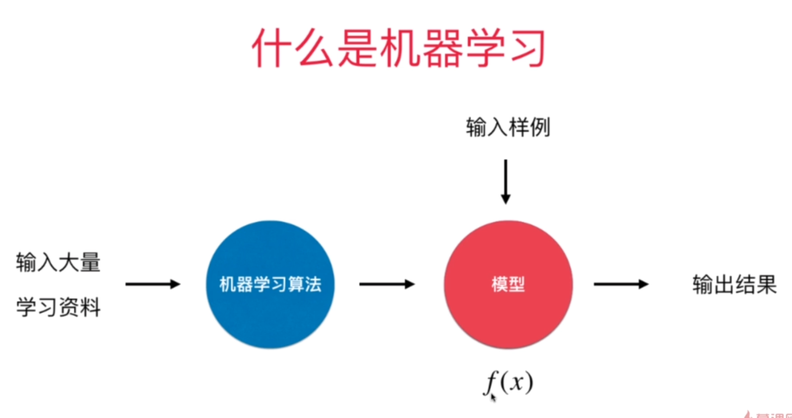
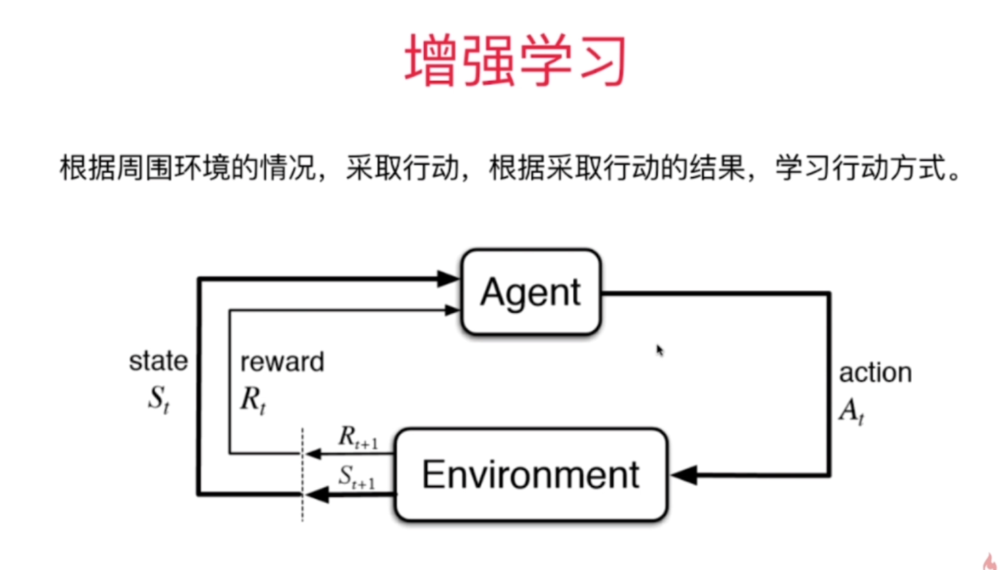
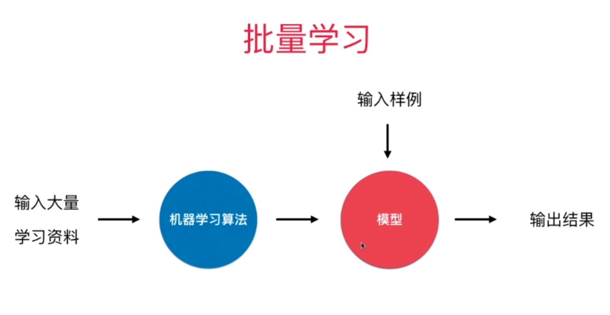
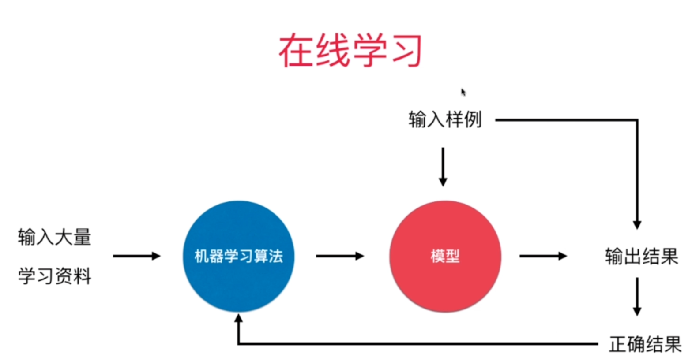

# 机器学习基础

## 机器学习的基础

### 1.机器学习的数据

数据主要是用sklearn提供的数据集。

### 2.机器学习的基本任务

* 分类

  * 二分类

    * 判断邮件是不是垃圾邮件
    * 判断发放给客户信用卡有没有风险
    * 判断病患良性肿瘤；恶性肿瘤
    * 判断某支股票涨跌

  * 多分类

    > 一些算法只支持完成二分类的任务；但是多分类的任务可以转换成二分类的任务；有一些算法天然可以完成多分类任务

    * 数字识别
    * 图像识别 
    * 判断发放给客户信用卡的风险评级

* 回归

  > 结果是一个连续数字的值，而非一个类别。有一些算法只能解决回归问题；有一些算法只能解决分类问题
  > ；有一些算法的思路既能解决回归问题，又能解决分类问题。一些情况下，回归任务可以简化成分类任务。

  * 房屋价格
  * 市场分析 
  * 学生成绩
  * 股票价格

* 什么是机器学习？

  

### 3.机器学习方法的分类

* 监督学习

  给机器的训练数据拥有“标记”或者“答案”

  * 例子
    * 图像已经拥有了标定信息
    * 银行已经积累了一定的客户信息和他们信用卡的信用情况
    * 医院已经积累了一定的病人信息和他们最终确诊是否患病的情况
    * 市场积累了房屋的基本信息和最终成交的金额
  * 我们在这个课程中学习的大部分算法，属于监督学习算法 
    * k近邻
    * 线性回归和多项式回归
    * 逻辑回归
    * SVM
    * 决策树和随机森林

* 非监督学习

  给机器的训练数据没有任何“标记”或者“答案”

  * 对没有“标记”的数据进行分类 - 聚类分析；

  * 对数据进行降维处理，方便可视化；
    * 特征提取：信用卡的信用评级和人的胖瘦无关？
    * 特征压缩：PCA

  * 异常检测；

* 半监督学习

  * 一部分数据有“标记”或者“答案”，另一部分数据没有；
  * 更常见：各种原因产生的标记缺失；
  * 通常都先使用无监督学习手段对数据做处理，之后使用监督学习手段做模型的训练和预测。

* 增强学习

  根据周围环境的情况，采取行动；根据采取行动的结果，学习行动方式。例如aphaGO，无人驾驶，机器人。

  

### 4.机器学习的其他分类

* 批量学习（离线学习）

  

  *  优点：简单

  * 问题：如何适应环境变化？

    解决方案：定时重新批量学习

  * •缺点：每次重新批量学习，运算量巨大；

    ​             在某些环境变化非常快的情况下，甚至不可能的。

* 在线学习

  

  * 优点：及时反映新的环境变化

  * 问题：新的数据带来不好的变化？

    解决方案：需要加强对数据进行监控

  * 其他：也适用于数据量巨大，完全无法批量学习的环境。

* 参数学习

  特点是：一旦学到了参数，就不再需要原有的数据集

* 非参数学习

  ​	

  * 不对模型进行过多假设
  * 非参数不等于没参数

## Jupyter Notebook，numpy，matplotlib的使用

### 1.Jupyter Notebook基础

### 2.Jupyter Notebook中的魔法命令

* `%run`
* `%timeit`
* `%%timeit`
* `%time`
* `%%time`
* `%lsmagic`
* `%run?`

### 3.numpy.array 基础

* Python List的特点

  可以放入类型不同的数据

* Python中的固定类型的数组array

   array这种数组的类型是固定的，不能既能存储整数又能存储字符串，其中```array.array(param1. param2)```param1是表明该数组类型的字符串,上面的`i`表明该数组中存储的是整数。

* numpy.array

  numpy.array中的类型是受限的，只能是一种。

### 4.创建 numpy.array

* numpy.array
* zeros 创建全0矩阵
* ones 创建全1矩阵
* full 创建指定数值的矩阵arange 与Python中range函数相对应，其中步长参数可以是浮点数
* linspace 表示在0-20区间内截取10个点形成数组，每个数的间距是相同的
* random
  * randint
  * seed随机种子
  * random 生成0-1的随机浮点数
  * normal 形成一个均值为0方差为1的浮点数，取正态分布的随机数
  * `np.random?` 查看random中的更多方法
  * `help(np.random.normal)`

### 5.numpy.array 基本操作

* numpy.array 的基本属性

  * `x.ndim`查看数组的维数
  * `x.shape`查看一个数组的行数和列数
  * `x.size`查看一个数组的元素个数

* numpy.array 的数据访问

  * numpy多维数组的访问方式

    建议用`X[0, 0]`,不建议用`X[0][0]`。因为`X[:2, :3]`与`X[:2][:3]`结果不一样，在numpy中使用","做多维索引。

  * 多维数组中切片的应用

    * `X[:2, :3]`取前两行的前三列
    * `X[:2, ::2]`加了步长
    * `X[::-1, ::-1]`行列倒置
    * `X[0, :]`取第一行的所有列，也就是第一行第一列
    * `X[:, 0]`取第一列的所有行，也就是去第一列第一行

* numpy.array的矩阵

  * 修改子矩阵也会修改原矩阵

    ```python
    subX = X[:2, :3]
    subX
    #array([[0, 1, 2],
    #       [5, 6, 7]])
    
    subX[0, 0] = 100
    subX
    #array([[100,   1,   2],
    #       [  5,   6,   7]])
    
    X
    #array([[100,   1,   2,   3,   4],
    #       [  5,   6,   7,   8,   9],
    #       [ 10,  11,  12,  13,  14]])
    ```

  * 使用原矩阵的副本

    ```python
    subX = X[:2, :3].copy()
    ```

* Reshape 修改数组的维度

  * `x.reshape(2, 5)`二维的矩阵，有两个方括号
  * `x.reshape(-1, 10)`只管把他变为有10列的矩阵
  * `x.reshape(10, -1)`只管把他变为有10列的矩阵

### 6.numpy.array 合并和分割

* 合并
  * `np.concatenate([x, y])`将两个向量或是数组合并
  * `np.concatenate([x, y])`axis默认为0，沿着行的维度拼接，设为1是沿着列的维度拼接
  * `np.concatenate([A, A], axis=1)`axis设为1是沿着列的维度拼接
  * `np.vstack([A, z])` 在垂直方向上智能拼接矩阵，可以用于矩阵和向量的合并
  * `np.hstack([A, B])` 在垂直方向上智能拼接矩阵，可以用于矩阵和向量的合并

* 分割
  * `x1, x2, x3 = np.split(x, [3, 7])`np.split(x, [3,7])分割数组为三部分，数组[3,7]其实就是分割点
  * `x1, x2 = np.split(x, [5])`np.split(x, [5])将数组分割为两段
  * `A1, A2 = np.split(A, [2])`矩阵的分割，默认是axis=0按照行来进行分割的
  * `A1, A2 = np.split(A, [2], axis=1)`矩阵的分割，axis=1按照列来进行分割的
  * `upper, lower = np.vsplit(A, [2])`vsplit在垂直方向上进行分割
  * `left, right = np.hsplit(A, [2])`hsplit在水平方向上进行分割
  * `X, y = np.hsplit(data, [-1])`将矩阵最后一列处进行水平分割


### 7.numpy.array 中的运算

* 给定一个数组，让数组中每一个数乘以2
  * 在python语言中是怎么做的
  * 在numpy中是怎么做的
* 矩阵的算术运算
  * 加、减、乘、除、整除、平方、取余
  * 矩阵特殊的函数运算
  * 对X中的元素去e的X次方
  * 取矩阵每个元素的三次方
  * 以10为底取对数
* 矩阵之间的运算
  * 加、减、乘、除
  * 线性带数中矩阵的乘法
  * 矩阵的转置
* 向量和矩阵的运算
  * 加法
  * numpy中行向量的堆叠
  * 乘法
  * numpy中矩阵与向量相乘的自动转置
* 矩阵的逆
* 矩阵的伪逆